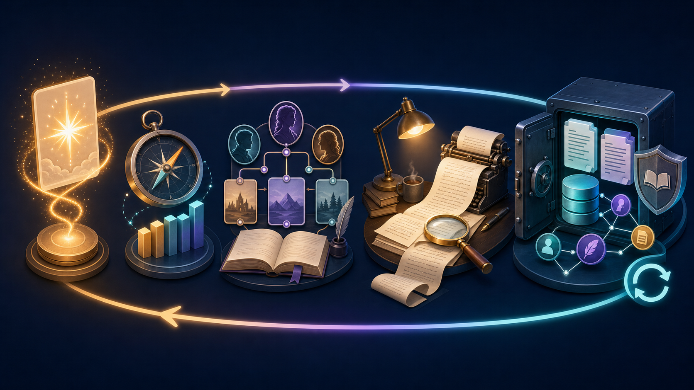

# Ani Book Skill

[](https://github.com/ExplosiveCoderflome/ani-book-skill/actions/workflows/validate.yml)
[中文](README.md) · [Changelog](docs/releases/release-notes.md) · [Contributing](CONTRIBUTING.md) · [Security](SECURITY.md)

> Use Codex to turn an idea, chapters, continuity, and cross-book canon into a novel-production system that can keep going.

Current version: `0.3.0` (2026-07-21)

**Ani Book Skill** is a Codex-native production system for long-form Chinese fiction. It turns a rough idea into a story engine, volume and chapter plans, stable prose, durable continuity, reusable assets, and shared-IP canon.

It is built for the three long-form problems that one-off prompting does not solve: why a chapter matters, how facts stay stable across dozens of chapters, and how multiple books safely reuse and govern a shared universe.

## Codex-native, not another agent runtime

**Codex itself is the only engine for creative understanding, planning, generation, review, and judgment.** The Skill is the process contract; Python performs only deterministic state, validation, indexing, conflict detection, and export. This is not an `AI-Novel-Writing-Assistant` runtime or submodule: it does not add a model-provider SDK, Web API, database authority, queue, or custom agent runtime. Provider/model fields are Token diagnostics only when exposed by the Codex host.

```text
Codex: story understanding, relationships, planning, writing, review, impact judgment
  -> Skill/contracts: required inputs, outputs, and acceptance rules
  -> Python: deterministic validation, evidence, conflict protection, rebuildable indexes
  -> Markdown/YAML authority; JSONL/SQLite disposable derivatives
```



*From the first spark to shared canon: every accepted change remains traceable instead of making context more chaotic.*

## What is production-ready now

| Layer | What you get | What stays protected |
| --- | --- | --- |
| **Idea to chapter** | Reader promise, story engine, plans, prose, revision, and review | Progressive confirmation, chapter obligations, and quality debt |
| **Long-form continuity** | Recoverable facts, promises, resources, character state, and relationships | Only accepted material enters durable memory; user edits are never overwritten |
| **Cross-book knowledge graph** | Reusable mechanisms, shared entities, canon events, and impact reports | Every node has evidence and a fingerprint; graph results remain candidates |
| **Shared-IP governance** | `fork` / `sync`, canon candidates, explicit publishing, revocable delegation | Conflicts do not overwrite prose; impact review never bulk-updates books |

Start from an idea when you are new to a novel, or resume from an existing workspace and asset library when maintaining a series. The system always exposes one recoverable next step rather than asking you to assemble prompts and context manually.

## The production chain — stabilize prose, continuity, and assets together

This is not a linear “generate another passage” chat. It is a production loop that calibrates, accumulates, and recovers after every accepted chapter:

| Stage | What moves forward | What stays protected |
| --- | --- | --- |
| **01 · Find direction** | Reader promise, chart opportunities, or the real problem in an existing story | A vague idea is not prematurely frozen into an outline |
| **02 · Build the engine** | Protagonist drive, rules, relationships, and volume-level promises | Every volume has a clear reason to keep reading |
| **03 · Finish one chapter** | Chapter contract, bounded context, complete prose, humanization, review | Goals, character limits, turns, and the ending pull remain coherent |
| **04 · Create the next foundation** | Facts, promises, resources, relationship changes, recovery checkpoints | Only accepted material becomes durable memory |

```text
Direction → story engine → chapter plan → complete prose → review and commit
    ↑                                                       ↓
    └──────────────── continuity state and next chapter ───┘
```

**The key rule: stabilize one chapter at a time.** No stitched parallel fragments, no unreviewed candidates becoming facts, and no need to load the entire novel into the next context. Only accepted material can become a cross-book asset or a shared-universe event candidate.

## Cross-book knowledge graph and shared universe

The private, Git-ignored `libraries/` folder can hold finalized reusable assets (`reusable`) and shared-IP canon (`universe`). A schema-v3 book imports each asset as either a standalone `fork` or protected `sync` link. Synchronization only reports an update or conflict—it never overwrites prose. The author explicitly keeps the local version, adopts shared canon, or approves/delegates a canon update.

```powershell
python scripts/asset_graph.py init libraries
python scripts/asset_graph.py publish libraries <accepted-candidate.yaml> --author-approved
python scripts/asset_graph.py import libraries novels/<novel-name> <asset-id> --mode sync
python scripts/asset_graph.py reconcile libraries novels/<novel-name>
python scripts/asset_graph.py context libraries novels/<novel-name> --assets <asset-id> --max-depth 2 --max-chars 4000
python scripts/asset_graph.py validate-selection libraries novels/<novel-name> novels/<novel-name>/context-packages/chapter-001.assets.yaml
python scripts/novelctl.py context novels/<novel-name> --chapter 1 --asset-library libraries --asset-selection context-packages/chapter-001.assets.yaml --output context-packages/chapter-001.md
python scripts/asset_graph.py verify-candidate novels/<novel-name> novels/<novel-name>/production/asset-candidates/chapter-001/<asset-id>.yaml
python scripts/asset_graph.py delegate-universe libraries --enabled
python scripts/asset_graph.py canon-check libraries
python scripts/asset_graph.py timeline libraries
python scripts/asset_graph.py impact libraries <canon-candidate.yaml> --workspace novels/<novel-name>
```

One library is one shared-IP universe by default. Published `universe/event` assets derive a canon timeline from stable sequence numbers, participants, effects, and optional precedence. `canon-check` validates endpoints, evidence, order, and cycles; `impact` only reports the explicit workspaces' affected sync links, chapter selections, and timeline neighborhood, never rewriting any artifact. Publishing still needs author approval, per-asset delegation, or active universe-level Codex delegation. The graph is derived only from accepted continuity and approved/delegated finalized assets; its bounded results are candidates, and Codex re-reads the YAML/Markdown authority before writing. See the [cross-book asset graph contract](references/cross-book-asset-graph.md).

## What it helps you do

| Challenge | Workflow | Durable output |
| --- | --- | --- |
| Find a viable direction | Analyze public chart metadata without reading novel prose | Snapshots, reports, opportunity cards |
| Turn an idea into a serial engine | Confirm only the few creative choices that matter, then plan volumes and chapter obligations | Brief, bible, cast, volume plan, beats |
| Keep chapters from drifting | Plan → bounded context → complete draft → humanization → review → continuity commit | Prose, review, delta, next action |
| Keep long-running memory affordable | Treat YAML as authority and SQLite as a rebuildable index | Checkpoints, readable views, bounded context |
| Understand model usage per step | Record every generation call without mixing exact, estimated, and unavailable measurements | Append-only usage ledger and step/model summaries |

## Why this is more than a prompt collection

- Start with reader promise before expanding the setting.
- Commit one accepted chapter at a time; unreviewed candidates never become story facts.
- Preserve facts, resources, promises, character state, and relationships with stable IDs and chapter evidence.
- Keep manuscripts and research local, inspectable, editable, and portable.

## Start with one prompt

```text
Use $produce-long-form-novel to plan a long novel from my idea.
```

If you explicitly have no idea, Codex first offers five one-sentence opening seeds with distinct angles: strong hook, character growth, setting wonder, relationship pull, and mystery investigation. After you choose or edit one—or provide your own idea—it creates two materially different new-book brief previews. Only after you choose, combine, or delegate a direction does it confirm the opening settings and write the authoritative `novel-brief.md`.

For an existing workspace:

```text
Use $produce-long-form-novel to continue novels/<novel-name>/ and determine the next safe production step.
```

For market research or authorized analysis:

```text
Use $produce-long-form-novel to analyze recent xianxia chart composition and create opportunity cards.
```

```text
Use $produce-long-form-novel to deconstruct this authorized novel text; establish coverage, segment notes, and an overview first.
```

## Install and use local tools

Install this repository as a personal Codex Skill, then invoke `$produce-long-form-novel`. See [SKILL.md](SKILL.md) for the complete workflow contract.

Python 3.10+ is required. Install the YAML continuity dependency:

```powershell
python -m pip install -r requirements.txt
```

```powershell
python scripts/novelctl.py init novels/<novel-name> --title "<novel-title>"
python scripts/novelctl.py set-opening-choices novels/<novel-name> --channel "male-oriented" --publication-format "free serial" --primary-reader-reward "growth and reversals"
python scripts/novelctl.py status novels/<novel-name> --format markdown
python scripts/novelctl.py next novels/<novel-name>
python scripts/novelctl.py migrate novels/<novel-name> --dry-run
python scripts/novelctl.py migrate novels/<novel-name>
python scripts/novelctl.py validate novels/<novel-name>
python scripts/novelctl.py reconcile novels/<novel-name>
python scripts/novelctl.py approve novels/<novel-name> --target chapter_range --range-start 1 --range-end 5
python scripts/novelctl.py export novels/<novel-name>
python scripts/export_novel_txt.py novels/<novel-name>
python scripts/check_continuity_workspace.py novels/<novel-name>
python scripts/continuity_store.py migrate novels/<novel-name> --dry-run
python scripts/analysis_retrieval.py build analyses/<analysis-name>
python scripts/trend_snapshot.py validate trends/<scope>/snapshots/<date>/<platform>-<chart>.jsonl
python scripts/token_usage.py record novels/<novel-name> --route novel --step chapter_draft --measurement unavailable --reason runtime_usage_not_exposed
python scripts/token_usage.py summarize novels/<novel-name> --write
```

`novels/`, `analyses/`, `trends/`, and `libraries/` are ignored by default to protect private manuscripts, source texts, research snapshots, and asset libraries.

## Clear boundaries

- Chart research uses public metadata only; it does not infer guaranteed trends from a single snapshot.
- Reference analysis requires authorized material and produces transferable mechanisms, not close imitation.
- This is a writing workflow, not a hosting platform or a replacement for author judgment.

## Origin and license

This standalone, documentation-first Skill was distilled by the maintainer of [AI-Novel-Writing-Assistant](https://github.com/ExplosiveCoderflome/AI-Novel-Writing-Assistant) from long-form production experience. It does not include or depend on that project's frontend, backend, database, or runtime services.

Repository files are released under the [Apache License 2.0](LICENSE). See the [changelog](docs/releases/release-notes.md) for the latest updates.

## Latest update

Version `0.3.0` now starts an explicit no-idea path with five distinct opening seeds, then two materially different new-book brief previews after the user chooses or supplies an idea. Only a selected, combined, or delegated direction can enter authoritative brief confirmation. It also adds the Skill currency check: compare the authoritative source with the installed mirror before first use and after Skill-surface changes. See the [changelog](docs/releases/release-notes.md) for the full latest release notes.
